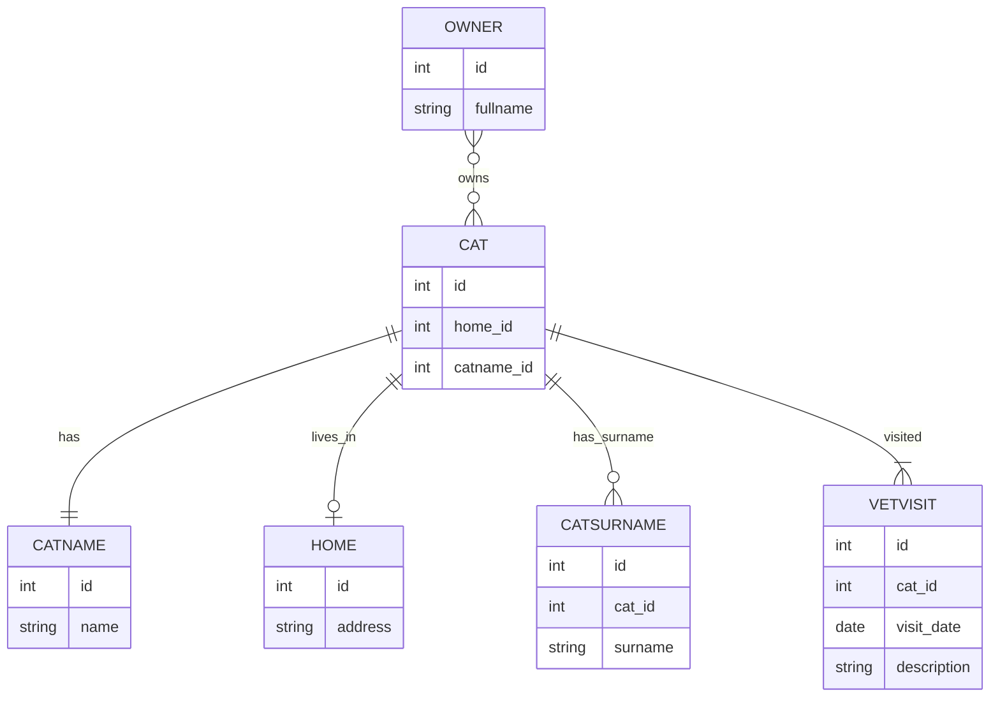
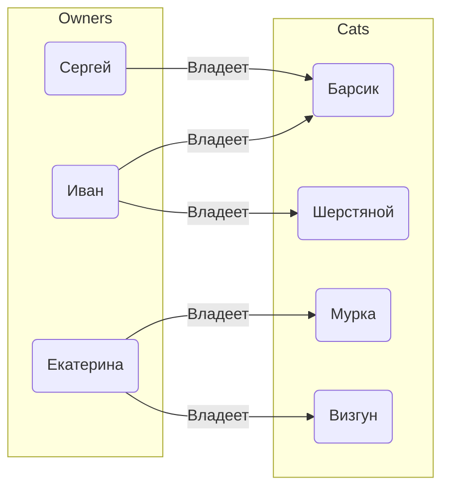
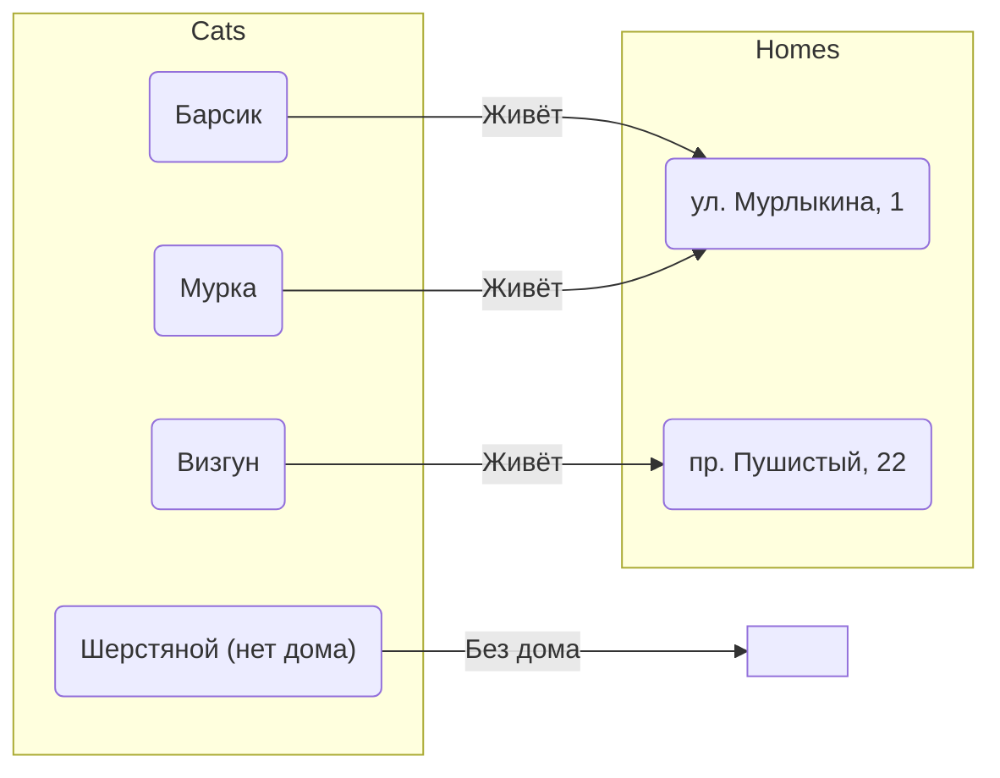
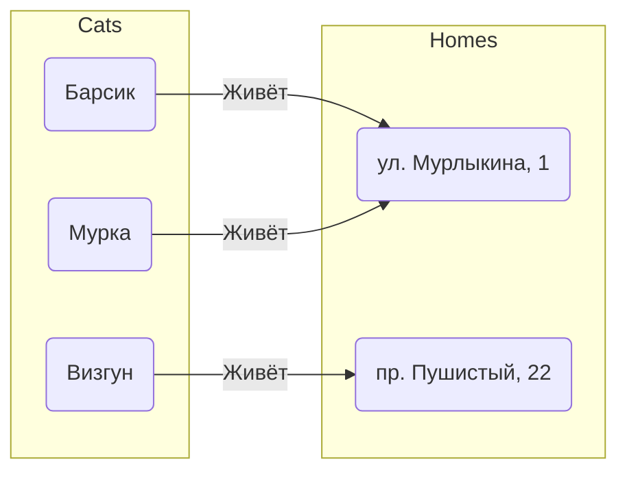
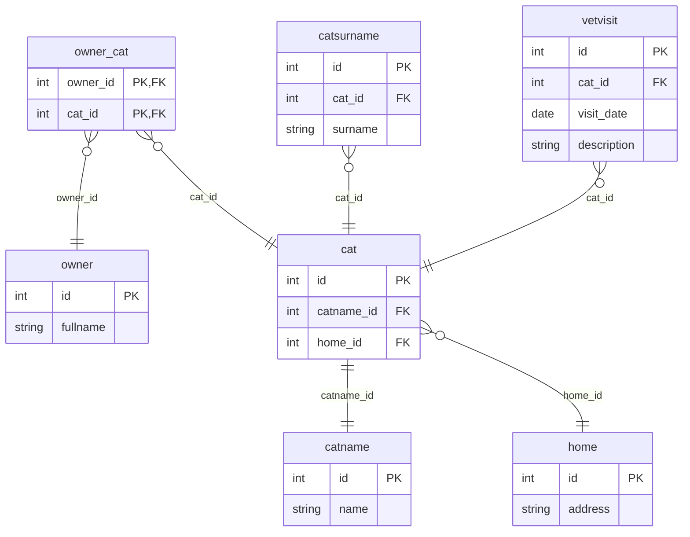

# `JOIN` – что это, зачем это, как это?

## О видео

## О проекте

### ER-модель
Пример того как может выглядеть ER-модель:


Больше информации про ER-моделирование можно узнать по [ссылке](https://en.wikipedia.org/wiki/Entity%E2%80%93relationship_model?ysclid=mhn2d1h6ax723269151).

Шпаргалка по аннотациям связей:


#### Примеры

\# Пример 1: Множество котиков (A) и множество владельцев (B). `INNER JOIN` выбирает пары на пересечении:



\# Пример 2: Для `LEFT JOIN` — коты всегда есть, дома могут быть, могут не быть:



\# Пример 3: Для `INNER JOIN` — выбирает только тех котов, у которых есть дом. "Бездомные" пропадают из результата:



### Физическая модель


#### Демонстрация физической таблицы

Данные в базе данных выглядят примерно так как в таблице `cat`:

| id | catname_id | home_id |
|----|------------|---------|
| 1  | 1          | 1       |
| 2  | 2          | 1       |
| 3  | 3          | 2       |
| 4  | 4          |         |

Но мы как дата-инженеры и исследователи данных хотим понимать что значат эти данные, поэтому без `JOIN` никак. Ниже показаны возможности `JOIN`.

### Поднятие инфраструктуры

Для запуска инфраструктуры:

```bash
docker compose up -d
```

Для воссоздания БД:

```bash
docker exec -i my_postgres psql -U postgres -d postgres < cats_db.sql
```
