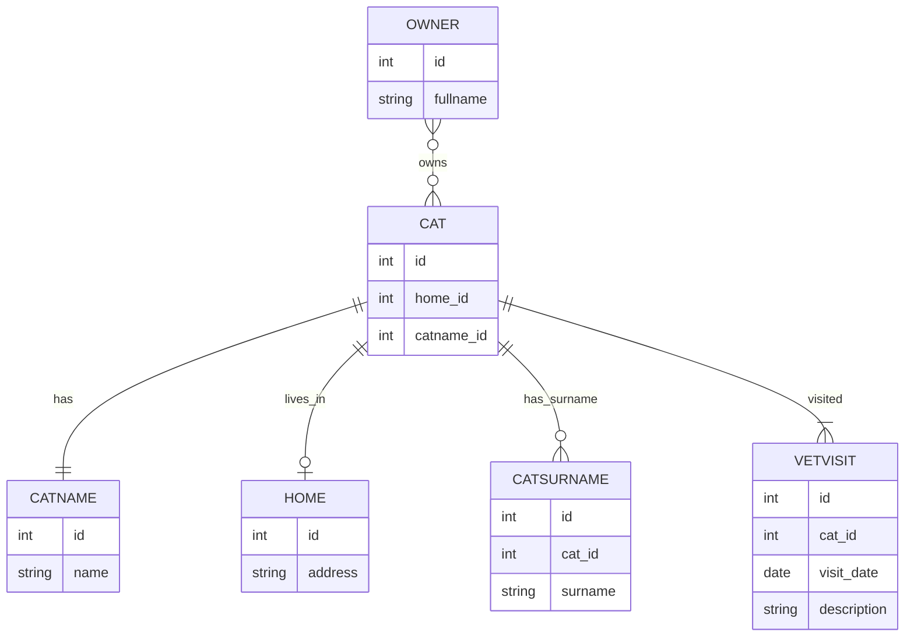
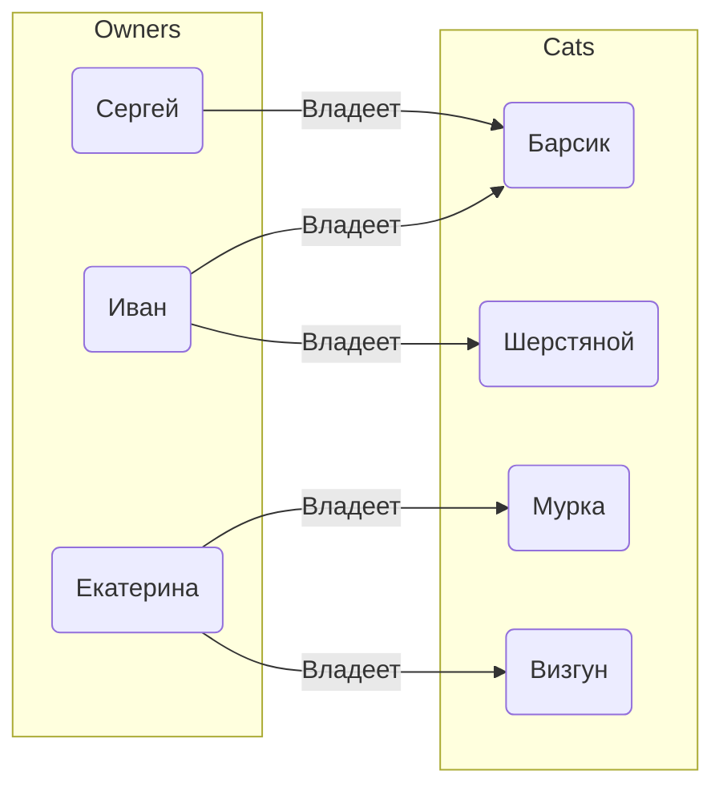
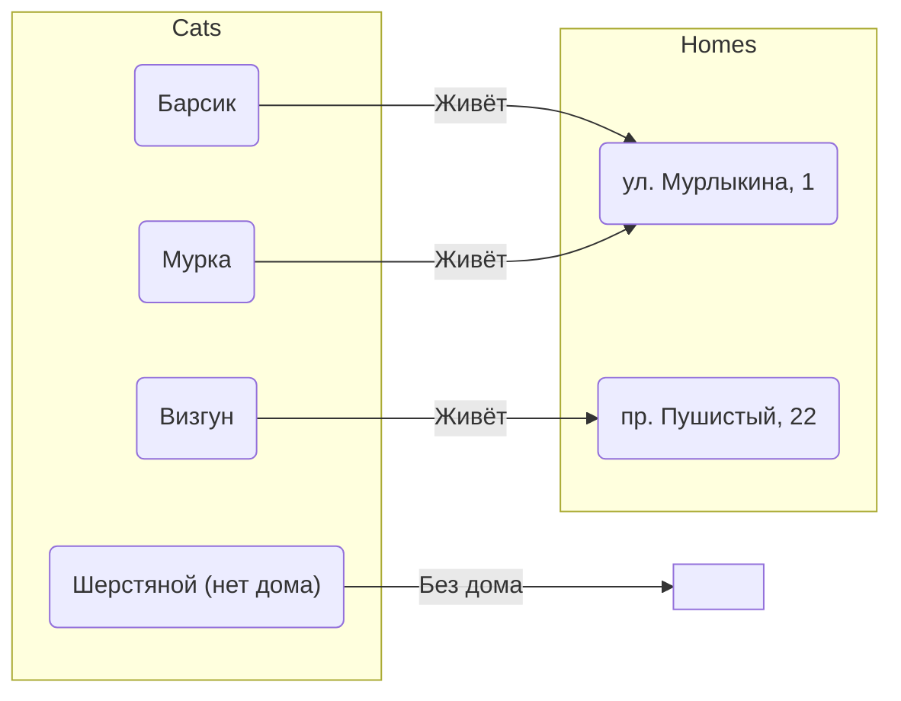

# Простой DataLake: Trino + S3 Minio + Spark + Iceberg

## О видео

## О проекте


```mermaid
erDiagram
    CAT ||--|| CATNAME : has
    CAT ||--o| HOME : lives_in
    OWNER }o--o{ CAT : owns
    CAT ||--o{ CATSURNAME : has_surname
    CAT ||--|{ VETVISIT : visited

    CAT {
        int id
        int home_id
        int catname_id
    }
    CATNAME {
        int id
        string name
    }
    HOME {
        int id
        string address
    }
    OWNER {
        int id
        string fullname
    }
    CATSURNAME {
        int id
        int cat_id
        string surname
    }
    VETVISIT {
        int id
        int cat_id
        date visit_date
        string description
    }
```


```mermaid
flowchart LR
  subgraph Owners
    O1("Иван")
    O2("Екатерина")
    O3("Сергей")
  end

  subgraph Cats
    C1("Барсик")
    C4("Шерстяной")
    C2("Мурка")
    C3("Визгун")
  end

  O1-->|Владеет|C1
  O1-->|Владеет|C4
  O2-->|Владеет|C2
  O2-->|Владеет|C3
  O3-->|Владеет|C1
```


```mermaid
flowchart LR
  subgraph Cats
    C1("Барсик")
    C2("Мурка")
    C3("Визгун")
    C4("Шерстяной (нет дома)")
  end
  subgraph Homes
    H1("ул. Мурлыкина, 1")
    H2("пр. Пушистый, 22")
  end

  C1-->|Живёт|H1
  C2-->|Живёт|H1
  C3-->|Живёт|H2
  C4-->|Без дома|X[ ]
```

### Поднятие инфраструктуры

Для запуска инфраструктуры:

```bash
docker compose up -d
```
